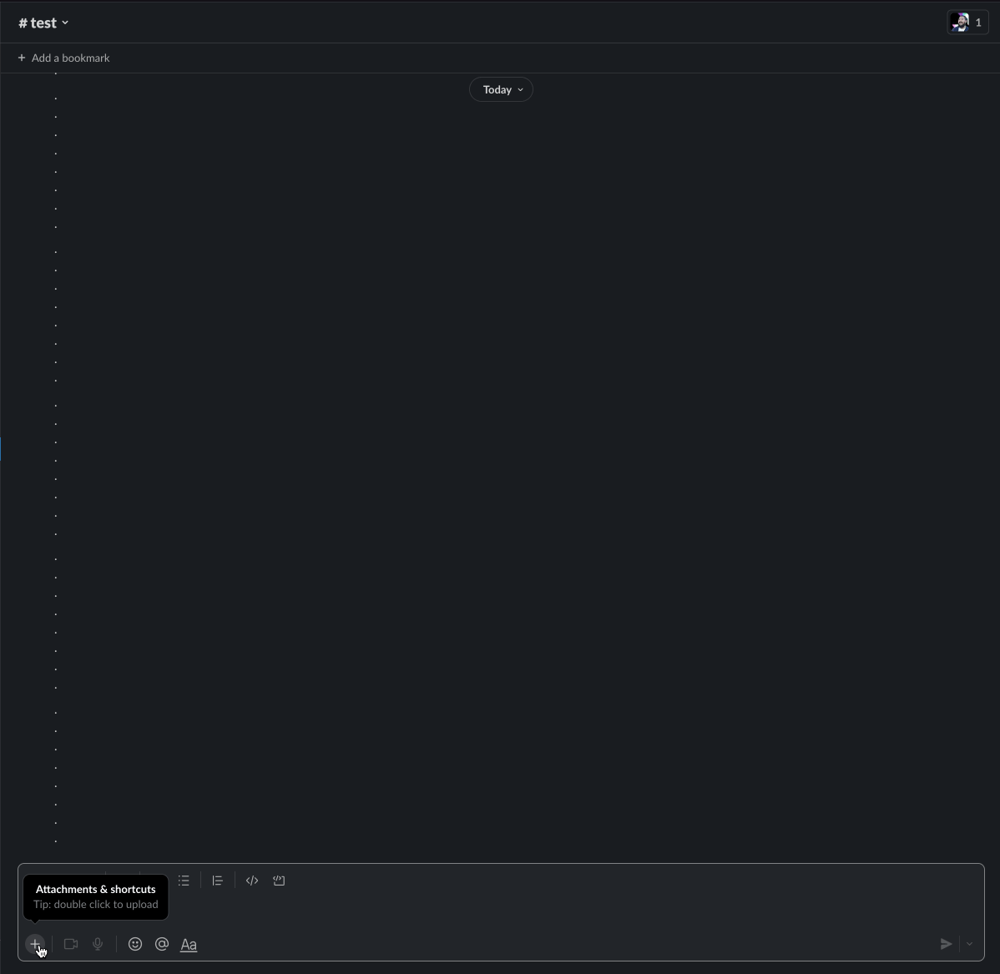

Sensitive Koala is a Slack bot that hides sensitive images behind a modal. This is useful for newsrooms who need to share sensitive images in public channels, or for innocuous things like hiding spoilers for the next Marvel movie.

Requires users to host images outside of slack

⚠️ **Caution:** This bot assumes links to images are valid. It does not validate images and will silently fail when trying to open a modal to the provided image url

## Installation

Requirements:

- Setup own Slack app at https://api.slack.com/apps
- Hosting provider with domain to run a Node with Postgres (Database is required to store OAuth tokens. No other data is stored)
  - Heroku.com has a free tier with postgres as an addon

### Slack setup

1. Visit https://api.slack.com/apps and create a new app from **Manfiest**
2. Select development workspace
3. Copy and paste [app manifest](./app-manifest.yaml)
   - 📝 be sure to replace `https://YOUR-DOMNAIN.COM` with your fully qualified domain

### Hosting setup

1. Copy `.env.example` to `.env`
2. Fill in `DATABASE_URL`
3. Retreive your `SLACK_` secrets from your app dashboard created in the steps above
4. In production environment, set `NODE_ENV` to `production`

### Final installation steps

1. In the Slack app dashboard, click on Manage Distribution (URL looks like https://api.slack.com/apps/YOUR-APP-ID/install-on-team)
2. Copy the sharable URL and paste it into the browser
3. Complete the OAuth flow to install this app on your team

## Usage

### Global

1. Click on the + button in the composer
2. Type "Add sensitive content"
3. Click on the action to trigger the modal
4. Insert a **Valid Public URL** to an image to the modal
5. A button to open a modal will be posted in Channel

### Message Action

1. Hover over a message
2. Under "More Message shortcuts" look for "Add sensitive content"
3. CLick on the action to trigger the modal
4. Insert a **Valid Public URL** to an image to the modal
5. A button to open a modal will be posted in Thread

## Development

`yarn dev` will transpile typescript and run the `dist/index.js`. Changes will trigger a rebuild
